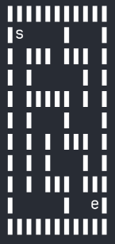
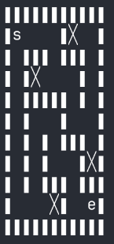
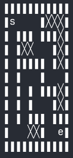
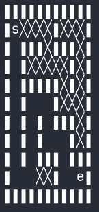
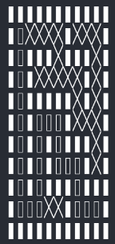
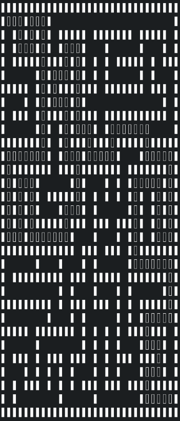
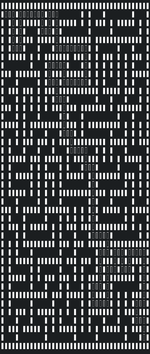
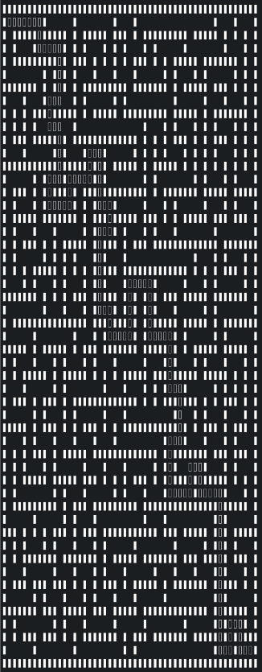

# Курсач: генерация лабиринта и нахождения крачайщего пути из него 

Алгоритм поиска основан на случайных числах определяющих направление движения. В алгоритме реазивана система памяти плохих ходов. 

> ## Как работает алгоритм нахожения путей?
> Алгоритм поиска плохих ходов основан на подсчете количества стен и ходов, приводящих в плохие ходы.
> ## Пример
> s - start
> e - end
>
>> 
> 
> При нахождение тупика ставится "╳" - что означает, что это точка плохо путь
>
>> 
>
> При нахожени точки, у которой следующий ход приведет к плохому пути и при этом данная точка не является перекрестком, это точка считается плохим путем 
>
>>    
>
> И если данная точка перекресток и N ( количество путей ) = badN ( количество плохих путей) - 1 - то данная точка является плохой 
>
>> 
> 
> И в итоге мы получаем:
>
>> 

> ## Результаты на больших лабиринтах
> Данные результаты были полученые с помощью кода из тестовой ветки: multithreading
> Лабиринт 30x30
>> 
> Лабиринт 40x40
>> 
> Лабиринт 50x50
>> 

